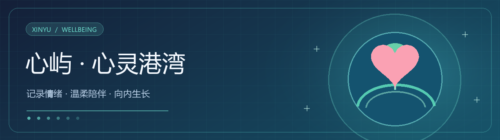
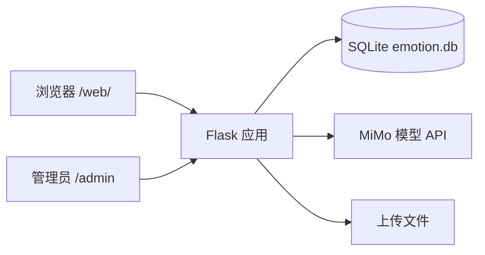

<div align="center">
  
  <h1>心屿 · 心灵港湾</h1>
  <p>面向大学生的情绪记录、心理测评与 AI 陪伴平台。</p>
  <p>
    
    
    
  </p>
  <p>
    <a href="#功能亮点">功能亮点</a> ·
    <a href="#快速启动">快速启动</a> ·
    <a href="docs/部署指南.md">部署指南</a> ·
    <a href="docs/技术文档.md">技术文档</a>
  </p>
</div>

---

心屿把日常情绪记录、量表测评、匿名交流和学习辅助工具放在一个 Web 应用中。AI 对话使用小米 MiMo 接口；未配置模型密钥时，非 AI 页面仍可用于本地体验。项目面向心理健康辅助场景，不替代专业诊疗或危机干预。

## 功能亮点

| 场景 | 已有模块 |
|---|---|
| 认识自己 | 心情记录、情绪趋势、PHQ-9 / GAD-7 / PSS / 睡眠质量量表 |
| 获得陪伴 | MiMo AI 对话、治愈信箱、虚拟桌宠 |
| 连接他人 | 匿名社区、评论互动、情感互助匹配 |
| 安排学习 | 笔记、番茄钟、课表与学习广场 |
| 平台管理 | 用户与内容管理、数据统计 |

## 系统结构



前端使用 HTML、CSS 和原生 JavaScript；后端位于 `backend/`，提供页面、REST API 和 SQLite 数据存储。仓库中的 Android 客户端与 Web 服务共用部分能力。

## 快速启动

在 Windows PowerShell 中从仓库根目录运行：

```powershell
cd backend
py -3.12 -m venv .venv
.\.venv\Scripts\python.exe -m pip install -r requirements.txt
Copy-Item .env.example .env
# 编辑 .env：填写 MIMO_API_KEY、SECRET_KEY 和 ADMIN_PASSWORD
.\.venv\Scripts\python.exe app.py
```

打开 **http://127.0.0.1:5000/web/**；管理入口为 **http://127.0.0.1:5000/admin**。Linux/macOS、Gunicorn + Nginx、HTTPS、备份和排障步骤见[详细部署指南](docs/部署指南.md)。`python app.py` 使用调试服务器，仅适合本地开发。

## 项目目录

```text
backend/    Flask 服务、API、静态资源、SQLite 运行数据
frontend/   Web 前端页面与脚本
android/    Android 客户端
docs/       使用、技术与部署文档
```

## 文档导航

| 文档 | 内容 |
|---|---|
| [部署指南](docs/部署指南.md) | 本地启动、Linux 服务、HTTPS、备份与故障排查 |
| [技术文档](docs/技术文档.md) | 系统结构与接口说明 |
| [AI 技术说明](docs/AI技术说明.md) | AI 能力与实现背景 |
| [作品说明](docs/作品说明.md) | 产品定位与使用场景 |

## 数据与安全

生产部署前请更换示例密钥及管理员密码，保护 `backend/emotion.db`、上传文件和 `.env`。心理健康数据应有清晰的告知、保留与删除策略。仓库目前没有独立的开源许可证文件；公开可见不等于获得复制或商用许可。

